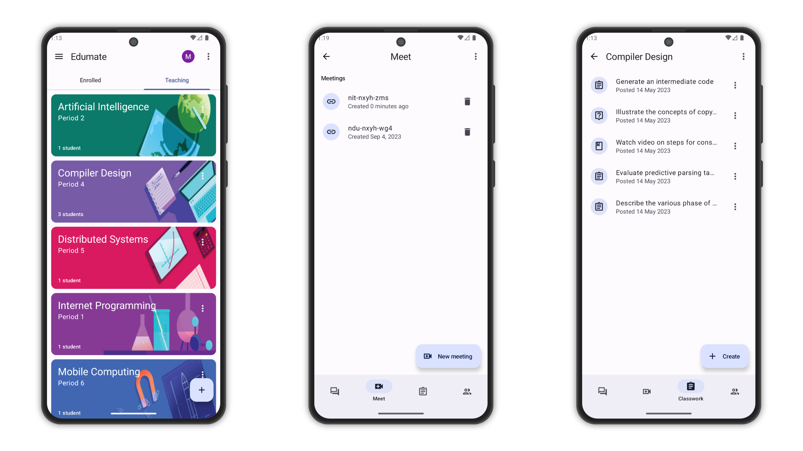
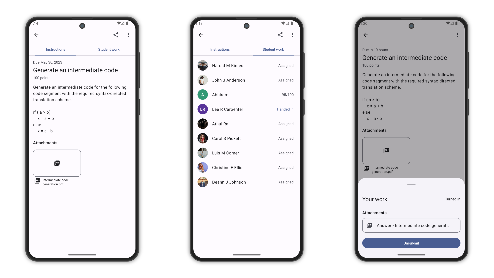

# Edumate

Edumate makes it easy for learners and instructors to connect – inside and outside of schools.
Edumate saves time and paper and makes it easy to create classes, distribute assignments,
communicate and stay organised.

There are many benefits to using Edumate:

- Easy to set up – Teachers can add students directly or share a code with their class to join. It
  takes just minutes to set up.
- Saves time – The simple, paperless assignment workflow allows teachers to create, review and mark
  assignments quickly, all in one place.
- Improves organization – Students can see all of their assignments, and all class materials (e.g.,
  documents, photos, and videos).
- Enhances communication – Edumate allows teachers to send announcements and start class discussions
  instantly. Students can share resources with each other or provide answers to questions on the
  stream.

## Screenshots

<picture>
  <source media="(prefers-color-scheme: dark)" srcset="screenshots/screenshot1-dark.png">
  <source media="(prefers-color-scheme: light)" srcset="screenshots/screenshot1.png">
  
</picture>

<picture>
  <source media="(prefers-color-scheme: dark)" srcset="screenshots/screenshot2-dark.png">
  <source media="(prefers-color-scheme: light)" srcset="screenshots/screenshot2.png">
  
</picture>

## Architecture

The Google Classroom-like Android app is built with a robust architecture to ensure maintainability,
scalability, and clean code. We've used the MVVM pattern with Clean Architecture:

- **MVVM (Model-View-ViewModel)**: This architecture pattern separates the user interface from the
  business logic and data, making the app easy to test and maintain.

- **Clean Architecture**: It ensures a clear separation of concerns, making it easier to make
  changes in the future without disrupting the entire app.

## Getting Started

To run the app locally, follow these steps:

1. Clone the repository to your local machine.
2. Open the project in Android Studio.
3. Build and run the app on an Android emulator or a physical device.

## Contributing

Contributions are welcome! If you'd like to contribute to this project, please fork the repository,
create a branch, make your changes, and submit a pull request.

## License

```
Copyright 2021 The Android Open Source Project

Licensed under the Apache License, Version 2.0 (the "License");
you may not use this file except in compliance with the License.
You may obtain a copy of the License at

    https://www.apache.org/licenses/LICENSE-2.0

Unless required by applicable law or agreed to in writing, software
distributed under the License is distributed on an "AS IS" BASIS,
WITHOUT WARRANTIES OR CONDITIONS OF ANY KIND, either express or implied.
See the License for the specific language governing permissions and
limitations under the License.
```

Feel free to explore the code and use this project as a reference for your own Android development
endeavors. If you have any questions or need assistance, please don't hesitate to reach out.

Happy learning!
