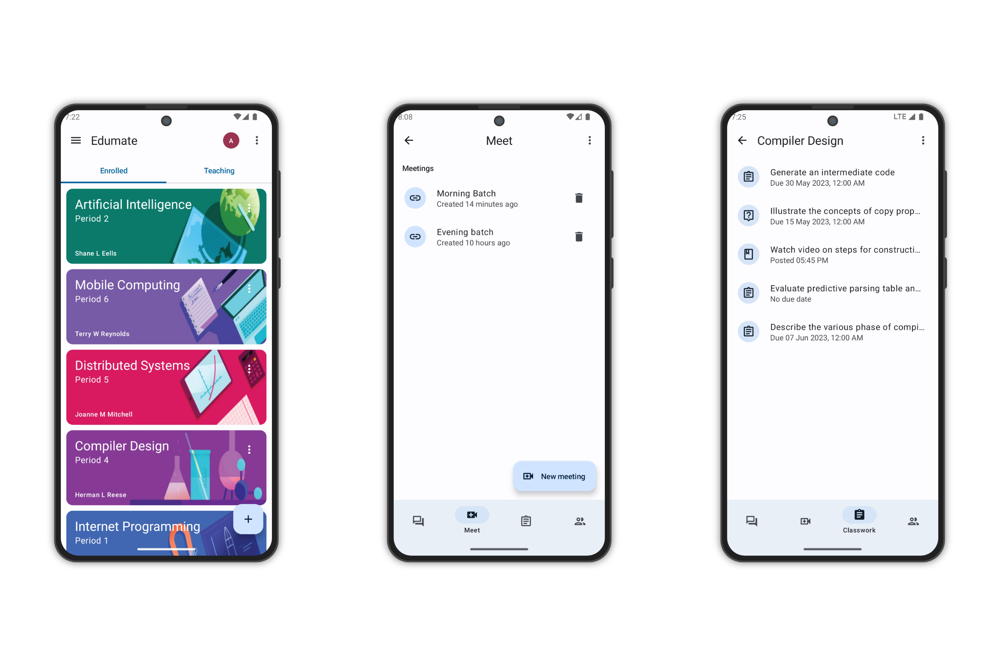
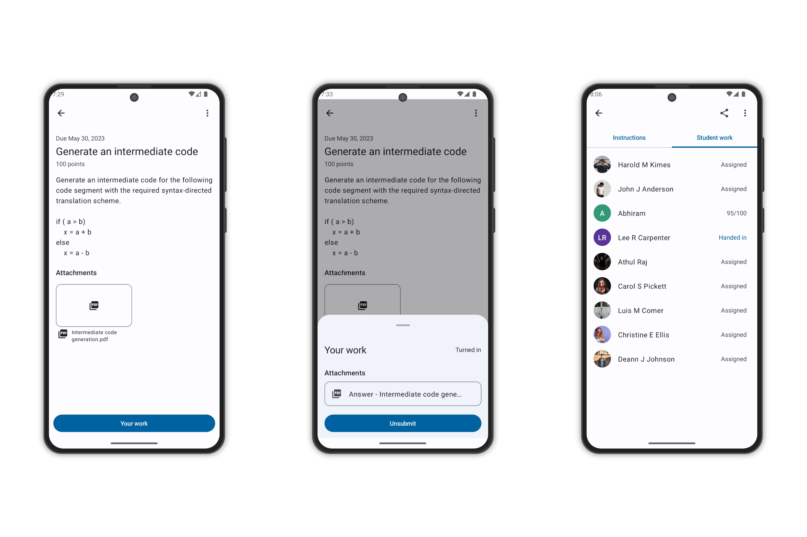

# Edumate

Edumate makes it easy for learners and instructors to connect – inside and outside of schools. Edumate saves time and paper and makes it easy to create classes, distribute assignments, communicate and stay organised.

There are many benefits to using Edumate:
- Easy to set up – Teachers can add students directly or share a code with their class to join. It takes just minutes to set up.
- Saves time – The simple, paperless assignment workflow allows teachers to create, review and mark assignments quickly, all in one place.
- Improves organization – Students can see all of their assignments, and all class materials (e.g., documents, photos, and videos).
- Enhances communication – Edumate allows teachers to send announcements and start class discussions instantly. Students can share resources with each other or provide answers to questions on the stream.

## Screenshots


<br>
<br>


## License

```
Copyright 2021 The Android Open Source Project

Licensed under the Apache License, Version 2.0 (the "License");
you may not use this file except in compliance with the License.
You may obtain a copy of the License at

    https://www.apache.org/licenses/LICENSE-2.0

Unless required by applicable law or agreed to in writing, software
distributed under the License is distributed on an "AS IS" BASIS,
WITHOUT WARRANTIES OR CONDITIONS OF ANY KIND, either express or implied.
See the License for the specific language governing permissions and
limitations under the License.
```