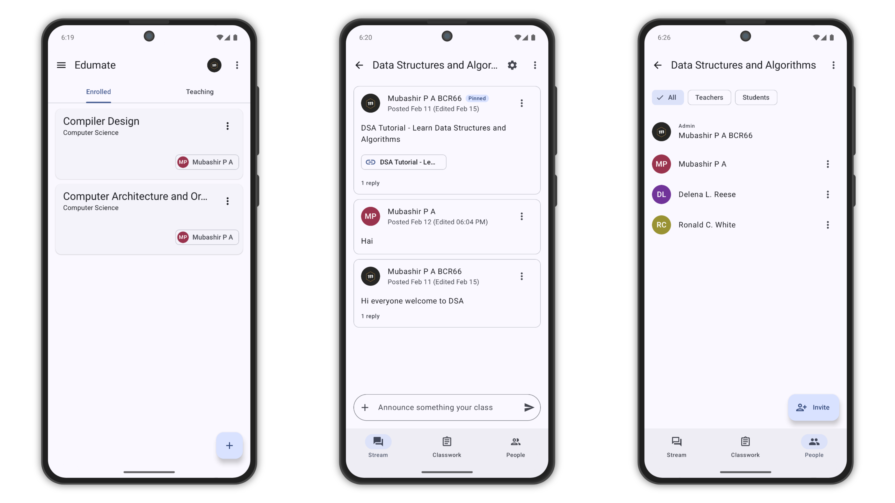
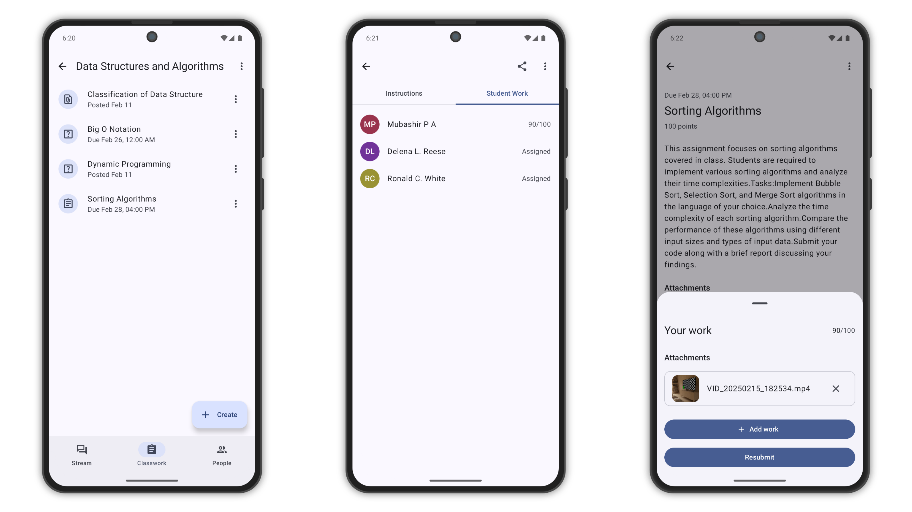

# **Edumate**

Edumate makes it easy for learners and instructors to connect—inside and outside of schools.
It saves time and paper while simplifying class creation, assignment distribution, and
communication.

## **Features**

- **Easy Setup** – Teachers can add students directly or share a class code for quick onboarding.
- **Paperless Workflow** – Teachers can create, review, and grade assignments efficiently in one
  place.
- **Organized Learning** – Students can access assignments and class materials (documents, images,
  videos) seamlessly.
- **Instant Communication** – Teachers can send announcements and initiate class discussions.
  Students can collaborate and answer questions.

## **Download the App**

Edumate is currently available on the **Amazon Appstore**.

<a href='#'>
<picture>
  <source media="(prefers-color-scheme: dark)" srcset="https://images-na.ssl-images-amazon.com/images/G/01/mobile-apps/devportal2/res/images/amazon-appstore-badge-english-black.png">
  <source media="(prefers-color-scheme: light)" srcset="https://images-na.ssl-images-amazon.com/images/G/01/mobile-apps/devportal2/res/images/amazon-appstore-badge-english-white.png">
  
</picture>
</a>

## Screenshots

<picture>
  <source media="(prefers-color-scheme: dark)" srcset="screenshots/screenshot1-dark.png">
  <source media="(prefers-color-scheme: light)" srcset="screenshots/screenshot1.png">
  
</picture>

<picture>
  <source media="(prefers-color-scheme: dark)" srcset="screenshots/screenshot2-dark.png">
  <source media="(prefers-color-scheme: light)" srcset="screenshots/screenshot2.png">
  
</picture>

## **Architecture**

Edumate follows a structured architecture inspired by **Google Classroom**:

- **MVVM (Model-View-ViewModel)** – Ensures a clean separation of UI and business logic for
  maintainability.
- **Clean Architecture** – Implements layers to enhance scalability and flexibility.

## **Getting Started**

To run the app locally:

1. Clone the repository:
   ```sh
   git clone https://github.com/your-repo/Edumate.git
   cd Edumate
   ```
2. Open the project in **Android Studio**.
3. Build and run the app on an emulator or physical device.

## **Environment Variables**

This project requires API keys and sensitive information that should not be committed to version
control. Ensure you have `local.properties` and `keystore.properties` in your project root with the
following keys:

1. **`local.properties`** (For API keys)

   ```properties
   ONESIGNAL_APP_ID=your-onesignal-app-id
   SUPABASE_ANON_KEY=your-supabase-anon-key
   SUPABASE_URL=your-supabase-url
   ```

2. **`keystore.properties`** (For signing the app)

   ```properties
   storePassword=your-store-password
   keyPassword=your-key-password
   keyAlias=your-key-alias
   storeFile=path-to-your-keystore.jks
   ```

### **Setup Instructions for Developers**

Before running the project, create `local.properties` and `keystore.properties` manually and add the
required values.

## **Contributing**

We welcome contributions! To contribute:

1. Fork the repository.
2. Create a feature branch:
   ```sh
   git checkout -b feature-name
   ```
3. Make your changes and commit:
   ```sh
   git commit -m "Add feature-name"
   ```
4. Push to your branch and open a **Pull Request**.

## **Support & Contact**

For issues or suggestions, feel free to open an [issue](#) or start a discussion.

Happy learning! 🚀
